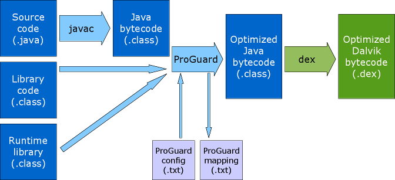

## Presented by dagezi

 Quipperにいます

  日本でスタディサプリ

 東南アジアで Quipper School


# Jack & Jill & Kotlin

もしくは「Kotlinはこの先生

きのこることができるか」

dagezi


## Jack & Jillとは?

- Android用 Javaコンパイラ群
- AndroidNでサポート強化
- AndroidNで機能強化


## APKができるまで



(from [saikoa](https://www.saikoa.com/blog/the_upcoming_jack_and_jill_compilers_in_android))


## Jackと Jillで


(from [saikoa](https://www.saikoa.com/blog/the_upcoming_jack_and_jill_compilers_in_android))


## Android Nで進化した

Lambdaが使えるように!!

しかも api level 7とかでも! やったぜ!!

あれ、でも Kotlin いらない子??


## lambdaとは何だったのか?

Java8にあったもの:

- 関数みたいなリテラルを簡単に書ける機能
- それを有効に使ったライブラリ群
- 効率的な lambdaの実装


## 関数みたいなリテラル

Java7:
```
  view.setOnClickListner(new View.OnClickListner() {
    @Override
    public void onClick(VIew view) {
      Log.d(TAG, "clicked");
    }
  });
```

Java8:
```
  view.setOnClickListner((v) -> Log.d(TAG, "clicked"));
```

Kotlin:
```
  view.setOnClickListner { Log.d(TAG, "clicked") }
```


## ライブラリ群

Android N でも Stream, Option とかはない
-  Java8のありがたみ半減

一方、Kotlinの collectionライブラリ


## 効率的な lambdaの実装

「~~非効率~~ Naiveな実装」とは?

- ラムダ式→ innerclass
- ロードに時間が掛かる
- 無駄にクラスを消費!
- retrolambdaは多分これ


## invokedynamic (indy) とは

- JRubyなどの動的言語のために Java 1.7で追加
- メソッド呼び出し法を実行時に決められる。
- リフレクションではないので JVMの最適化が効く!


## lambdaにおける indy

ラムダ式の変換を Runtime に追い出す
- ラムダ式の表現だけは固定
- 現状はメソッドをクラスを動的生成 & ロード
- 使われるかわからないものをロードしなくていい
- 将来的によりいい方法に移行できる

- [Translation of Lambda Expressions](http://cr.openjdk.java.net/~briangoetz/lambda/lambda-translation.html), Brian Goetz, 2012


## Jack & Jill では?

Java:
```Java
    public static void aho(List<String> ss) {
        Collections.sort(ss, (s0, s1) ->
            s0.length() - s1.length());
        Collections.sort(ss, (s0, s1) ->
            s0.length() + s1.length());
    }
```

dexdump:
 
```
Class descriptor  :
    'LStreamTest$-void_aho_java_util_List_ss_LambdaImpl0;'
Class descriptor  :
    'LStreamTest$-void_aho_java_util_List_ss_LambdaImpl1;'
```

ラムダ式ごとにクラスができてる!


## Kotlinは?

基本 Naiveな実装方法

- ただし、inline頑張る!

```Kotlin
fun ttt(ls: List<String>) : Boolean =
    ls.any {it.startsWith("aho")}
```


```
public inline fun <T> Array<out T>.all(predicate: (T) -> Boolean): Boolean {
    for (element in this) if (!predicate(element)) return false
    return true
}
```

lambdaもなにもなくなる!


## Jack & Jillで失うもの

- JVMを使ったエコシステム
- Annotation Processing


## まとめ

- 関数リテラル: 引き分け
- ライブラリ: Kotlin 辛勝
- 効率性: Kotlin 勝ち 
- その他にもいっぱいいいところ

よって Kotlinは不滅


## まとめ2

とはいうものの、Jack & Jillも進化するかも?

